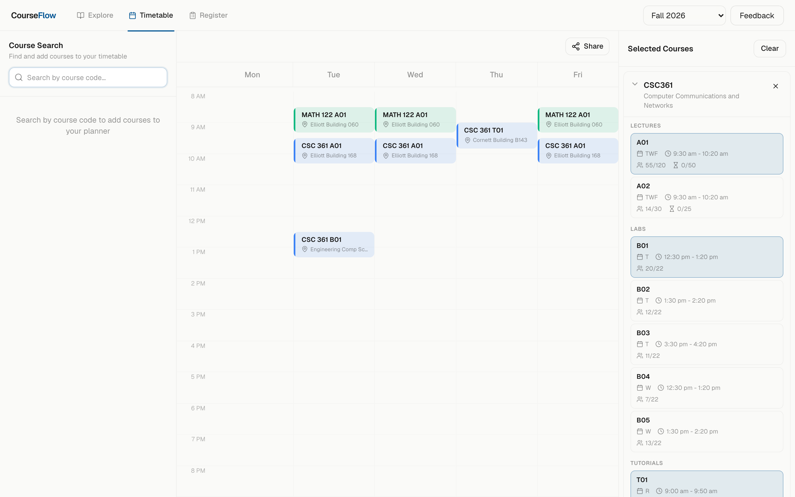

# CourseFlow

A course scheduler for the University of Victoria. Search the catalog, compare sections with live enrollment counts, and build a conflict-free timetable. Live at **[courseflow.smccl.ca](https://courseflow.smccl.ca)**.

<p align="center">
  
</p>

Fourth iteration of the project: it started as a Go CLI scraper, grew into a Go + React + MySQL app on a VPS, and was rewritten for Cloudflare's edge to run entirely on the free tier.

## Stack

- TanStack Start + Router + Query
- Cloudflare Workers, D1, and Durable Objects (real-time schedule sharing)
- Biome, TypeScript, Vitest

## Development

```bash
nub ci
nub run d1:migrate:local
nub run d1:seed:csc
nub run dev
```

`nub run check`, `nub run typecheck`, and `nub run test` must pass before deploying with `nub run deploy`.

Course data comes from a Worker-compatible TypeScript importer that ingests the Kuali catalog, Banner timetable sections, and live enrollment counts into D1 — see `nub run catalog:import`.

Secrets are set with `wrangler secret put`, never committed. Non-secret Worker vars live in `wrangler.jsonc`.

## Code organization

CourseFlow is one TanStack Start application, so it stays in one package. A new
package should have an independent consumer or deployment boundary; source
folders are enough for application-only features.

- `src/routes` contains thin file routes, loaders, and HTTP handlers.
- `src/queries` owns TanStack Query keys and client cache configuration.
- `*.functions.ts` files define `createServerFn` RPC boundaries that routes and
  components may import.
- `*.server.ts` files contain Cloudflare, D1, cookie, and other server-only code.
- Shared types and pure domain transforms live in purpose-named TypeScript
  modules and must remain safe to import in either environment.
- `src/components` contains rendering and interaction code; non-visual calendar
  layout logic is kept alongside the calendar components and tested directly.
