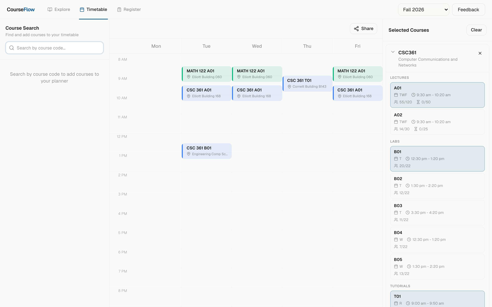

# CourseFlow

A course scheduler for the University of Victoria. Search the catalog, compare sections with live enrollment counts, and build a conflict-free timetable. Live at **[courseflow.smccl.ca](https://courseflow.smccl.ca)**.

<p align="center">
  
</p>

Fourth iteration of the project: it started as a Go CLI scraper, grew into a Go + React + MySQL app on a VPS, and was rewritten for Cloudflare's edge to run entirely on the free tier.

## Stack

- TanStack Start + Router + Query
- Cloudflare Workers and D1
- Biome, TypeScript, Vitest

## Development

In this project, we use [nub](https://github.com/nubjs/nub?og), and no that's not a typo for bun.

```bash
nub ci
nub run d1:migrate:local
nub run dev
```

`nub run check`, `nub run typecheck`, and `nub run test` must pass before deploying with `nub run deploy`.

Course data comes from `scripts/import.ts`, which fetches the Kuali calendars and Banner 9 sections and prints SQL for wrangler to apply:

```bash
nub scripts/import.ts courses > .wrangler/courses.sql
nub scripts/import.ts sections 202701 > .wrangler/sections-202701.sql
nubx wrangler d1 execute course-flow-v4 --local --file .wrangler/courses.sql
nubx wrangler d1 execute course-flow-v4 --local --file .wrangler/sections-202701.sql
```

Import courses before sections, so sections can link to them. Use `--remote` instead of `--local` for production.

Secrets are set with `wrangler secret put`, never committed. Non-secret Worker vars live in `wrangler.jsonc`.
